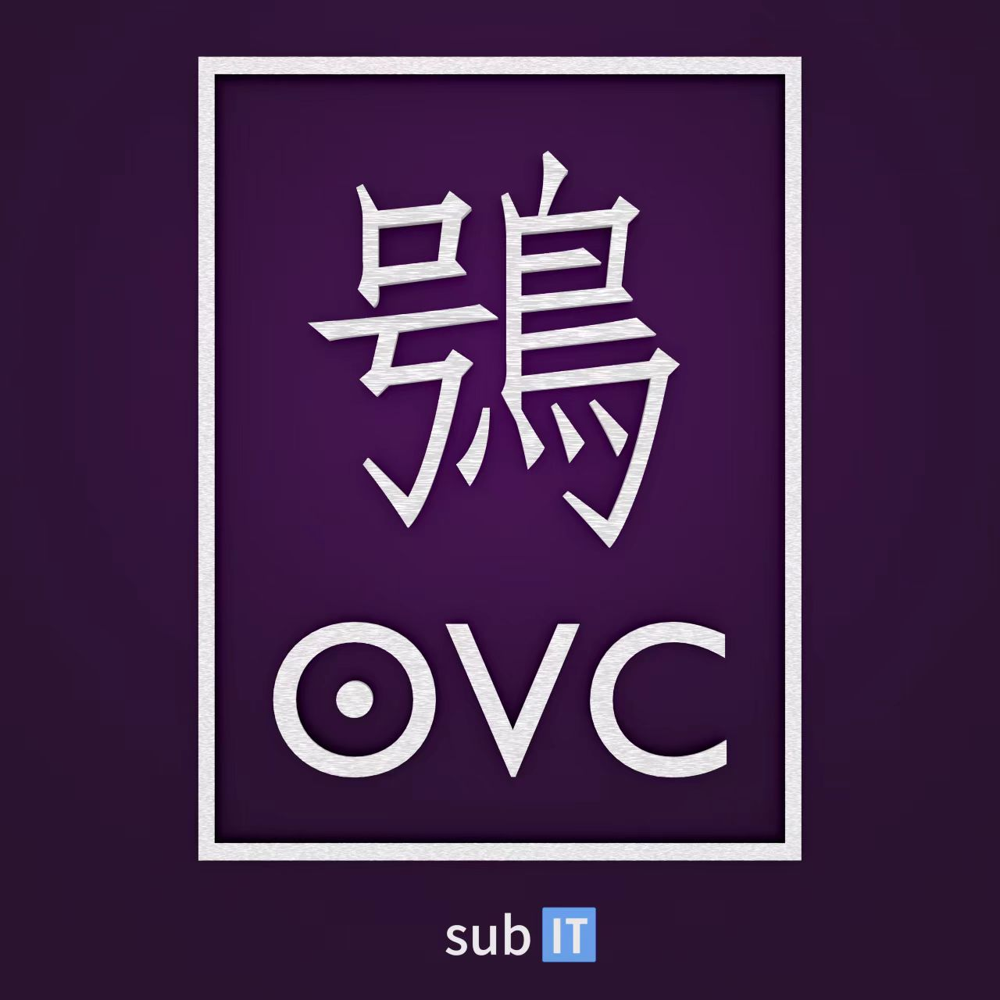

# SubIT Audio and Video (SubAV) SDK

We came up with this idea because we want a fast and simple SDK that can deal with pretty much all kinds of media import and export in our **VRFZ** game project.

---

## The Xiao (OVC)

**JPEG** as an image format is quite good and there are indeed some opensource implementation like **libjpeg**, however, I'm not satisfy with its 'too much compression' and its speed may not be the fast. So, we developed this image format based on **JPEG** and used some techniques to improve performance, and they are ***Rotor SIMD DCT*** and ***IKP MaxFOG Coding***. The image format inside this SDK has its own name *"Xiao"*, in our Chinese this means *"Owl"*, we use this name because owles have nice vision during nights and they are ferocious hunters, but if you are an English speaker, you may prefer calling it "OVC(O-Week)" which means "Owl Vision Core(Container)".

We also designed a "token-like" logo for this image format, this can also be treated as a feature.

</img>

**You may not use this logo as you want!**

## The Fu (DAC)
This is our audio format but still working in progress.

## The Mi (MMC)
This is our audio video format but still working in progress.

## How to use
It's easy to use this library.

If you look at our *CMakeLists.txt* you may find there are only two parts inside this library -- "sbavcore" and "sbavtool".

The "sbavcore" can be compiled to static or dynamic library (you must modify CMakeLists.txt your self) and depends on only C++ standard library.

The "sbavtool" is used to generate "ovc", "dac" and "mmc", it's not strictly necessary, however it will makes your life easier and can also be your program guide or example or something. This tool requires "FFmpeg" installed and in your path to run (We use console command straight forward), but program it self still only depends on C++ standard library.

All two parts requires complete **C++20** features to build.

By the way, since we also used some platform specific techniques, so this library currently only supports **x86/x64** CPUs and **Windows, Linux** platforms (We don't have **ARM** or **Android, Mac** support yet).

## Claims
I think that's already enough, but there are still something I want to mention. The first thing is this project uses **MIT** license, which gives you a lot of freedom, but you must follow its rules or we will not happy.

The second thing is I want to give my huge thanks to ***"Steve Wang"*** who developed the "IKP MaxFOG coding" inside "The Xiao" which is a fascinating algorithm that combines **JIT** and **Colomb coding**.

I also want to thank ***"Xincheng Hao"*** for his contribution to our artworks in **VRFZ** which is our main motivation, and he is also the one who created the logo Xiao (but it's designed by me).

This project still needs help, so if you want to be a contributor, feel free to contact us.

# The End

***Henry Du 2024.12.28***